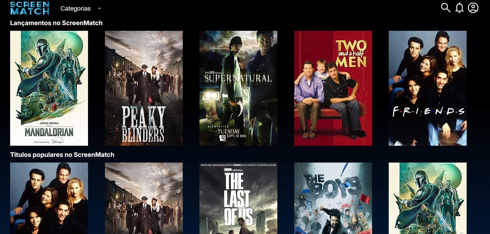
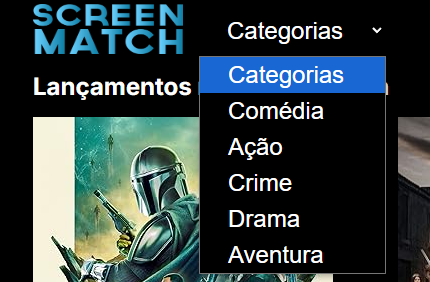
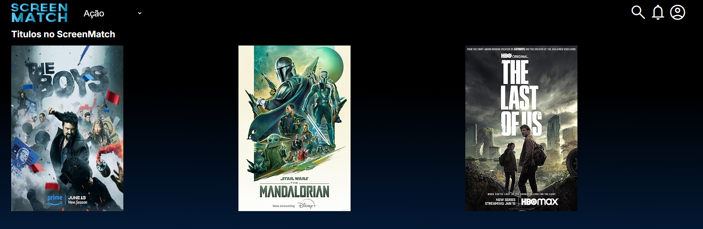
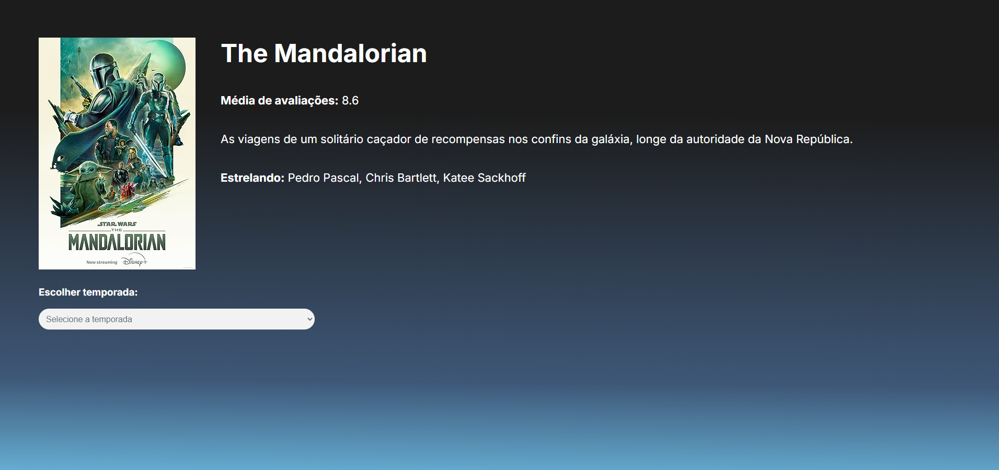
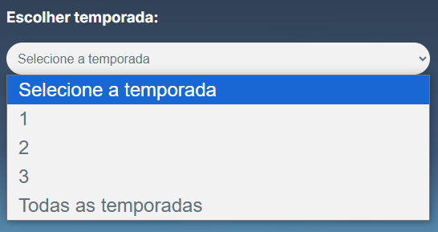
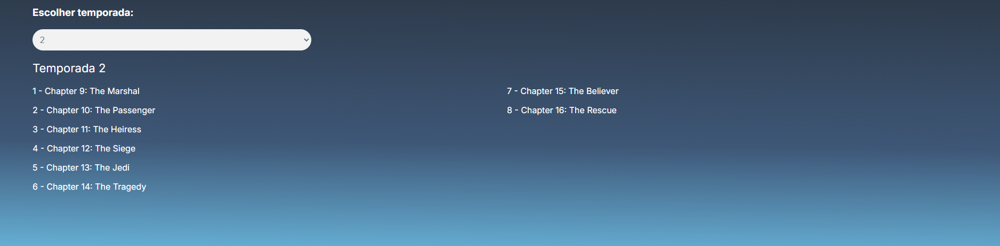
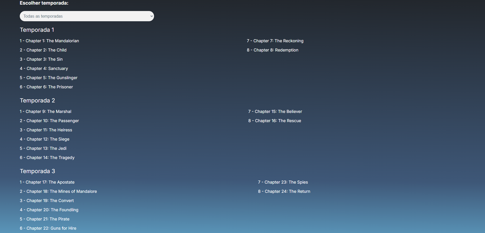

# 📽️ Projeto Screenmatch 📽️

---
#### 🚩 G7 ONE | Java e Spring Framework | 🚩
#### 🌎 [@Alura](https://www.alura.com.br/) | [@One](https://www.oracle.com/br/) 

*🎞️️ Projeto Screenmatch desenvolvido nas aulas do curso 🎞️️*

---
### Observações:
- _API utilizada: `(https://omdbapi.com/)`;_
- _`Maven`_
- _Banco de dados: `PostgreSQL`;_

---
### Requisitos:

---
### Tela incial:

> 

> 

### Escolher categoria:

> 

> 

### Selecionando série:

> 

### Escolher temporada:

> 

> 

> 