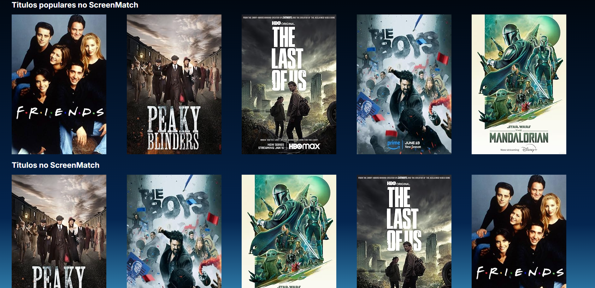

# 📽️ Projeto Screenmatch 📽️

---
#### 🚩 G7 ONE | Java e Spring Framework | 🚩
#### 🌠[@Alura](https://www.alura.com.br/) | [@One](https://www.oracle.com/br/) 

*🎞️️ Projeto Screenmatch desenvolvido nas aulas do curso 🎞️️*

---
### Observações:

- _API utilizada: `(https://omdbapi.com/)`;_
- _`Maven`_
- _Banco de dados: `PostgreSQL`;_

---
### Tela incial:

- _Ao iniciar a aplicação, na página web irá aparecer todas as séries cadastradas no banco de dados._

> 

- _Separadas por `Lançamentos`, `Títulos populares` e todos os `Títulos` do screenmatch._

> 

### Escolher categoria:

- _Ainda na tela inicia teremos a opção em escolher séries por categoria._

> 

- _Ao selecionar irá aparecer apenas as séries da determinada categoria escolhida pelo usuário._

> 

### Selecionando série:

- _Ao escolher uma série, entrará em uma página com algumas informações dessa séries sendo elas: `média de avaliações`, `sinopse` e `atores`._

> 

### Escolher temporada:

- _Dentro da série terá a opção de escolher determinada temporada._

> 

- _Ao escolher irá aparecer todos os episódios da temporada escolhida._

> 

- _Selecionando todas as temporas, irá aparecer todos os episódios de todas as temporadas._

> 